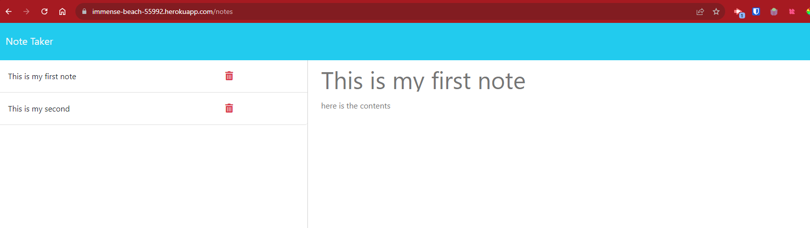

# all-the-notes

## Description

Creating a note-taking application using Express.js as a student is an exciting project for me. It offers a fantastic opportunity to gain hands-on experience in web development while utilizing a popular and widely-used framework. With Express.js, I can build a robust and efficient server-side application that meets my specific needs as a student. I can incorporate features like organization, search functionality, and collaboration to enhance my note-taking experience. This project will also deepen my understanding of database management and authentication, sharpening my overall web development skills. Most importantly, having a personalized note-taking app tailored to my study routine will significantly boost my productivity and learning outcomes.

## Table of Contents

- [Installation](#installation)
- [Usage](#usage)
- [License](#license)
- [Credits](#credits)
- [Tests](#tests)
- [Contact](#contact)

## Installation

No installation necessary, but if you wanted to run it locally:

1. Ensure Node.js and npm are installed.
2. Install the project dependencies (express, jest).
3. Clone this repository git@github.com:justjenb/all-the-notes.git.
4. Start your NPM server and navigate to your localhost and selected port.
5. Use the web app to add/remove notes from the db.json file.

## Usage

[Link to Live App](https://immense-beach-55992.herokuapp.com/)

## License

**This project is licensed under the [MIT](https://opensource.org/licenses/MIT) license.**

For more information about this license, please visit the following link:

https://opensource.org/licenses/MIT

## Credits

Borrowed heavily from previous modules.

References
 
https://github.com/rocketseat-education/bootcamp-gostack-desafio-01/blob/2ed4528e90104bb323872c928687c2d4cbfe1e31/index.js#L80

https://www.tabnine.com/code/javascript/functions/express/Express/delete

https://stackoverflow.com/questions/61526572/express-js-delete-request

https://expressjs.com/en/starter/basic-routing.html

## Tests

No tests.

## Contact

My name is Jen Butler.

Here is a link to my [GitHub](https://github.com/justjenb) profile. 

Additional contact details:

Contact me at jen@jenbutler.me
